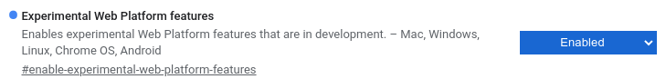
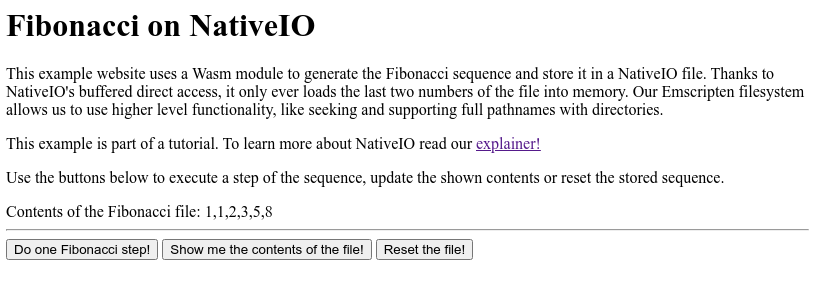
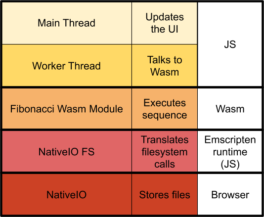

TODO: chage relative path to code
# How to port an application with NativeIO

This guide will show you, step-by-step, how to use NativeIO from a Wasm-ported
application. First we will install all dependencies, then compile our
application, and finally check the results of our work in the form of a website
that uses NativeIO as its storage backend.

<!-- START doctoc generated TOC please keep comment here to allow auto update -->
<!-- DON'T EDIT THIS SECTION, INSTEAD RE-RUN doctoc TO UPDATE -->


- [What is NativeIO?](#what-is-nativeio-what-is-nativeio)
- [Getting our dependencies](#getting-our-dependencies-getting-our-dependencies)
  - [Chrome](#chrome-chrome)
  - [Emscripten](#emscripten-emscripten)
  - [NativeIO Emscripten filesystem](#nativeio-emscripten-filesystem)
  - [Test application](#test-application)
- [Putting everything together](#putting-everything-together-putting-everything-together)
- [Running it](#running-it-running-it)
- [Further reading and future changes](#further-reading-and-future-changes-further-reading-and-future-changes)
  - [Why do we need a web worker?](#why-do-we-need-a-web-worker-why-do-we-need-a-web-worker)
  - [Directly calling NativeIO from the main and worker threads](#directly-calling-nativeio-from-the-main-and-worker-threads-directly-calling-nativeio-from-the-main-and-worker-threads)
  - [Expected changes](#expected-changes-expected-changes)

<!-- END doctoc generated TOC please keep comment here to allow auto update -->

## What is NativeIO?

First things first: NativeIO is a new storage API for the web. With its generic
interface and fast implementation, it’s designed to help developers that need a
low-level API for their performance-sensitive applications. A sizable part of
these applications rely on Wasm for efficient computation and access to existing
codebases, and so it’s important that NativeIO integrates well into that
platform. For more details and links to our discussion forum/issue tracker,
check out our [explainer](../README.md). We
would love to hear your feedback, so please reach out if you have any comments
during/after the tutorial.


## Getting our dependencies


### Chrome

Chrome Canary already contains a full implementation of NativeIO, so be sure to
[download it ](https://www.google.com/chrome/canary/)and enable it by going to
“chrome://flags” and setting “Experimental Web Platform features” to Enabled.



### Emscripten

Emscripten provides the compiler and runtime needed to port our application. You
can download and install it by following their
[guide](https://emscripten.org/docs/getting_started/downloads.html).

### NativeIO Emscripten filesystem

We’ve built our own library to allow Emscripten ports to use NativeIO. To use
it, all you have to do is clone the
[repository](https://github.com/fivedots/nativeio-emscripten-fs). We will then
add it to the runtime during compilation.

### Test application

Today we will use a simple
[application](https://github.com/fivedots/nativeio-how-to) that calculates the
Fibonacci sequence and stores the results in a NativeIO file. After we are done
building it, it will look something like this:



To get the code, run the following command:

```shell

git clone https://github.com/fivedots/nativeio-how-to.git

```

In the next sections we will compile it with Emscripten and locally serve it.
Then we will be able to try our hand at generating Fibonacci numbers by visiting
the site with Chrome. 

## Putting everything together

Now that we have all of the pieces, let’s build our application. The end result
will end up like this:



The [main
thread](https://github.com/fivedots/nativeio-how-to/blob/master/index.html) of
our application is in charge of rendering the page and sending messages to the
web worker. When the
[worker](https://github.com/fivedots/nativeio-how-to/blob/master/fibonacci_worker.js)
receives a message (‘do a step’, ‘get the data’ or ‘reset the file’), it calls
the right functions on the Wasm module and (if needed) sends the results back to
the main thread. A worker is needed in this example because we require the
synchronous NativeIO methods, check out the last section of this tutorial for
more information.

The [Wasm
module](https://github.com/fivedots/nativeio-how-to/blob/master/fibonacci.cpp)
can initialize the Fibonacci file or execute a step of the sequence. It
interacts with NativeIO using standard file functions that get delivered to the
NativeIO Emscripten filesystem. The NativeIO filesystem is the one that finally
interacts with NativeIO, executing the appropriate operations on the actual
file.

So go ahead and open a terminal on the directory where you cloned the test
application. From there execute the following command:

```shell

emcc --js-library ../path/to/library\_nativeiofs.js \

          --post-js ./fibonacci\_worker.js \

          -s DEFAULT\_LIBRARY\_FUNCS\_TO\_INCLUDE='["$NATIVEIOFS"]' \

          -s EXPORTED\_FUNCTIONS='["\_init", "\_step"]' \

          -s EXTRA\_EXPORTED\_RUNTIME\_METHODS='["cwrap"]' \

          -s USE\_PTHREADS=1    \

          -o fib.js \

          fibonacci.cpp

```

After that command is finished you should have everything you need to run the
test application! Still, those are a lot of flags, so let’s look at them in more
detail:

*   `--js-library ../path/to/library\_nativeiofs.js` adds the NativeIO
    filesystem to the Emscripten runtime, which is the explicitly included in
    the next argument
*   `-s EXPORTED\_FUNCTIONS='["\_init", "\_step"]'` explicitly tells Emscripten
    which Wasm function we will be using and therefore should be exported
*   `-s EXTRA\_EXPORTED\_RUNTIME\_METHODS='["cwrap"]'` tells Emscripten that we
    will be using the cwrap method, which helps us call the exported functions
*   `-s USE\_PTHREADS=1` forces our Wasm module to run on a
    SharedArrayBuffer-backed memory. More details on why this is necessary
    below.

## Running it

To run the application we just built, just run this command:

``` shell

emrun --serve\_after\_exit --no\_browser index.html

```

And, using the Chrome instance with experimental features enabled, head to
http://localhost:6931. That’s it!

NOTE: It’s worth mentioning that NativeIO can only be accessed from secure
origins, so your future websites would need to be served through HTTPS.

## Further reading and future changes

### Why do we need a web worker?

NativeIO offers both synchronous and asynchronous versions of its methods,
although the sync ones are only available within a worker thread. Currently
Emscripten only supports synchronous storage backends for its filesystems, so we
had to execute our Fibonacci application from a worker.

We are actively working on figuring out asynchronous filesystems, we hope we can
lift this restriction soon! If you need to access NativeIO from the main thread,
you can use the [Async
Wrapper](https://github.com/fivedots/nativeio-async-wrapper) mentioned below.

### Directly calling NativeIO from the main and worker threads

In this guide we used Emscripten’s runtime and interfaces to interact with
NativeIO. If you would like to know how to directly access our API, check out
the [NativeIO Async
Wrapper](https://github.com/fivedots/nativeio-async-wrapper). The instructions
and examples there will show you how you can call the Asynchronous methods from
NativeIO from both web workers and the main thread.


### Expected changes

As we develop, grow and explore the limits of NativeIO, it’s likely some of the
steps mentioned in this guide will change. To mention a few:

*   After providing an async Emscripten filesystem, we won’t need to marshall
    Wasm calls through a web worker.
*   It’s likely that we won’t require the Wasm module to use shared memory. If
    this design constraints turns out to be to difficult to change, we expect to
provide an Emscripten option that uses shared memory without enabling full
pthread support.
*   Soon you won’t need to use Chrome Canary, as NativeIO will be shipped in the standard Chrome distribution behind a flag.
*   The NativeIO Emscripten filesystem will eventually be upstreamed so that no extra download is required.
